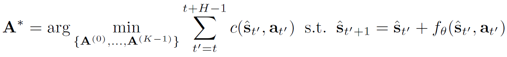
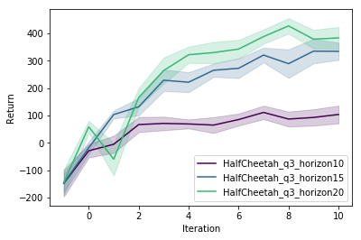
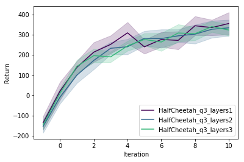
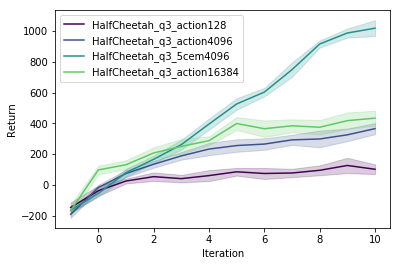
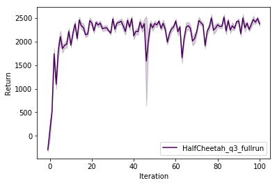

# CS294-112 HW 4: Model-based RL (MBRL)

## Overview
In this exercise, [model-based RL](https://arxiv.org/abs/1708.02596) with various different hyperparameters are evaluated.
Model-based RL consists of basically two parts:
- Learning a dynamics model
- Using a controller to plan and execute actions

## Model
### Dynamics Model
A neural networks `f` is learned where `s' = s + f(s, a)` holds in which it encodes the difference between the next state and the current state and certain to-be-executed action.
The learning process is to simply minimize the squared error of the actual state difference and the predicted one.
### Action Selection
Given the dynamics model the best action is determined by planing `H` timestep through `f` into the future and select and execute the first action `a` of the particular action sequences `A*`, which minimizes the total costs of all `K` random action sequences `A` the most:


Note, that a model predictive control (MPC) approach is adopted, where just the first action instead of the whole horizon `H` is executed, before proceeding to the next state and repeating.
Also, does this algorithm make use of a hand-crafted cost function due to the fact that a cost evaluation is needed before the actual action is executed.
The method how those continuous actions are selected for each state (the neural network `f` needs the current state `s` as well as a to-be-executed action `a` as an input parameter) are either random or further optimized through the cross-entropy method (CEM) where after the random action sampling, a zoom-in / more dense sampling in the region of interest (lowest cost value) achieved tremendous action selection improvements but also to the price of computational power.
### Algorithm
```delphi
Run base policy pi(a,s) (e.g. random policy) to collect D = {(s, a, s')} data
while not done do
    Train f using D
    s <- current agent state
    for t=0 to T do
        A* <- action selection method (s. chapter above)
        a <- first action in A*
        Execute a and proceed to next state s'
        Add (s, a, s') to D
    end
end
```

## Usage
```
python q1 --exp_name=<name>
```
MBRL parameters:
- `--exp_name`: Name of the experiment.
- `--env`: Name of the gym environment. Currently, just the `HalfCheetah` environment is supported. Default: `HalfCheetah`
- `--render`: Boolean desire to render. Default: `False`
- `--mpc_horizon`: Number of timesteps to plan into the future while action selection. Default: `15`
- `--num_random_action_selection`: Amount of randomly sampled action sequences for each timestep. Default: `4096`
- `--nn_layers`: Number of hidden layers in dynamics model. Shallow is preferred due to the unresistance of overfitting in the planning process. Default: `1`
- `--dcem`: Whether to explicitly enable the CEM method. Default: `False`

## Half-Cheetah Results
The most astonishing result for myself was that the model is able to let the half-cheetah run after just 27 episodes:


However by taking a deeper look into the graphs, what clearly stands out is not only the observation that the algorithm performs well with just one hidden layer with rarely an improvement by going deeper but also the restricted capability of reaching above 2500 in the long run.
Using model-based RL because of its sample-efficiency is a good starting point, however, fine-tuning afterward with the model-free algorithm of your choice is definitely necessary.
Furthermore, CEM enables the possibility to carefully sample for five times 4096 actions iteratively resulting in an incredible improvement towards sampling almost the same amount of actions (4*4096 = 16,384) once without CEM.

<table>
  <tr>
      <td align="center">Horizon: <i>{ 10 | 15 | 20 }</i></td>
      <td align="center">Layer: <i>{ 1 | 2 | 3 }</i></td>
  </tr>
  <tr>
    <td align="center"></td>
    <td align="center"></td>
  </tr>
  <tr>
      <td align="center">number of actions: <i>{ 128 | 4096 | 4096cem5 | 16384 }</i></td>
      <td align="center">A full run</td>
  </tr>
  <tr>
    <td align="center"></td>
    <td align="center"></td>
  </tr>
</table>