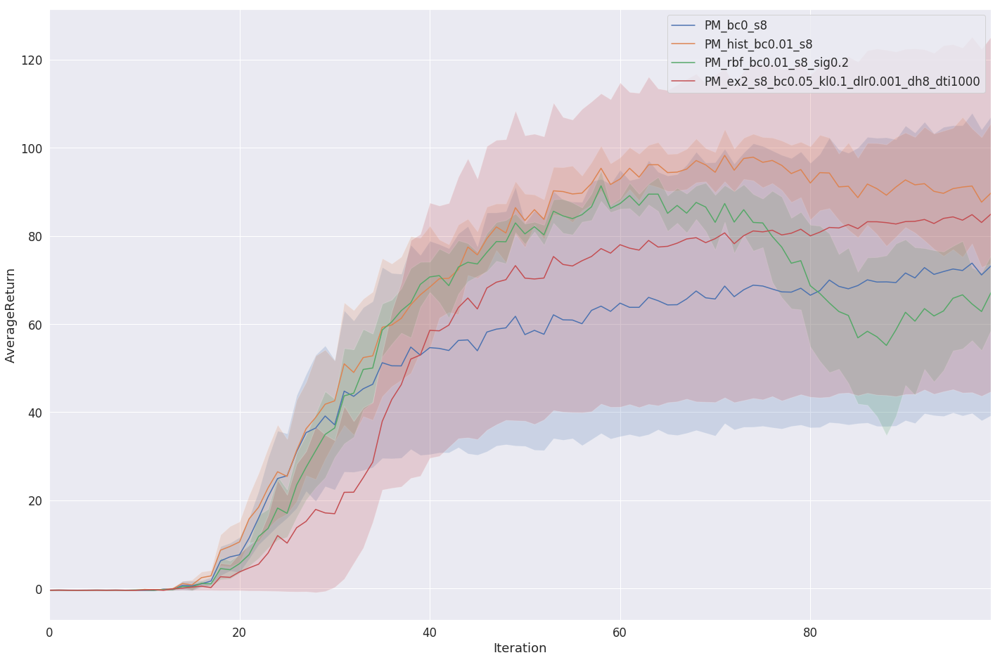
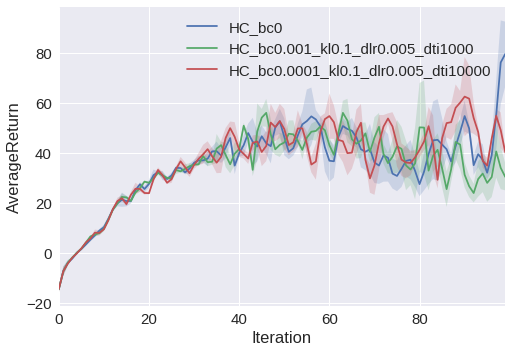

# CS294-112 HW 5a: Exploration

## Overview
In this exercise, various exploration techniques in an actor-critic setting are evaluated.
These are especially useful when it comes to sparse reward signals as e.g. present in `Montezuma's Revenge`.
According to Sergey Levine, the course instructor of CS294-112, could three methods be used for a more suitable exploration:
- **Optimistic Exploration**: Focuses on the exploration of new states, where the agent gets encouraged to visit less frequently visited states by adding an exploration bonus to the reward function.
- **Thompson sampling style**: Ensembles over Q-functions to gather different distributions.
- **Information gain style**: Prefers those states, where it could learn the most / receives the highest information gain.

In this exercise the focus is on __Optimistic Exploration__ techniques, where the bonus term is simply added to the reward and calculated in three different ways:
0. **No exploration**: No bonus.
1. **Histogram**: Binning states and counting the occurrences in each state-bin `N(s)`. Then the bonus term expresses itself as `B(s) = 1 / sqrt(N(s))`. This technique is useful for a small and discrete state space only.
2. **Kernel Density Estimate (RBF)**: Estimating the density of a state by calculating the probability `f(s)` of being in the buffer by multiplying its probability over each data point-Gaussians in the buffer. Then the bonus term expresses itself as `B(s) = - log(f(s))`.
3. **Exemplar**: Similar to GAN's does the Exemplar model provide a discriminator, which tries to distinguish between two same states bottlenecked by a small latent vector. This model is trained throughout the exploration to get the same states as close as possible together. Unseen states haven't got a valid latent representation yet so that the discriminator has an easy job, whereas for common states its nearly impossible to distinguish between states. This method is able to learn and with that finds similarities across a huge state space. More details: [EX2: Exploration with Exemplar Models for Deep Reinforcement Learning](https://arxiv.org/abs/1703.01260)

## Usage
```
python <env_name> --density_model = <hist|rbf|ex2|none>
```
Actor-Critic parameters:
- `--exp_name`: Name of the experiment. Default: `vac`
- `--render`: Boolean desire to render. Default: `False`
- `--discount`: Discount factor of Actor-Critic. Default: `1.0`
- `--n_iter | -n`: Number of training iterations. Default: `100`
- `--batch_size | -b`: Number of episodes per training iteration. Default: `1000`
- `--ep_len | -ep`: Maximal length of one episode (if no done signal recieved yet). Default: `-1.`
- `--learning_rate | -lr`: Learning rate of Actor-Critic. Default: `5e-3`
- `--dont_normalize_advantages | --dna`: Boolean desire to normalize the advantage function of the Actor-Critic. Default: `False`
- `--num_target_updates | -ntu`: Number of gradient steps per iteration / target-value-update for the critic. Default: `10`
- `--num_grad_steps_per_target_update | -ngsptu`: Number of gradient steps for each target value update in the critic. Default: `10`
- `--seed`: Random-Seed. Default: `1`
- `--n_experiments | -e`: Total number of parallel experiments. Default: `1`
- `--n_layers | -l`: Number of hidden layers in Actor and Critic. Default: `1`
- `--size | -s`: Dimension of hidden layer. Default: `32`

Exploration specific parameters:
- `--bonus_coeff | -bc`: Multiplier of bonus exploration reward. Default: `1e-3`
- `--density_model`: Exploration technique: `hist` or `rbf` or `ex2` or `none`.
- `--kl_weight | -kl`: How similar w.r.t KL-distance should the latent representation of states in the density model be. Default: `1e-2`
- `--density_lr | -dlr`: Learning rate of the density model.
- `--density_train_iters | -dti`: Number of training iterations of the density model. Default: `1000`
- `--density_batch_size | -db`: Batch-Size of density model update. Default: `64`
- `--density-hiddim | -dh`: Dimension of hidden layer of density model. Default: `32`
- `--replay_size | -rs`: Size of the replay buffer for the density model. Default: `1,000,000`
- `--sigma | -sig`: Standard deviation of the Gaussians in the RBF-Model. Default: `0.2`

## Results
### PointMass environment
This environment is basically a (20,20) grid, where the agent starts at (2,2) with the goal to reach (18,18). In fact, the agent receives a reward of one only at the goal, which makes the reward extremely spare and with that a perfect environment for testing.


Histogram is the undoubtful winner as a result of the small state space. Nonetheless the exemplar method performs really well too and clearly outperforms no exploration (it doesn't even find the target). The RBF method should be in between both extrems because it performs well in the beginning but deterioates in the end. This could be due to hyperparameter mischoice.
#### No exploration
```
python train_ac_exploration_f18.py PointMass-v0 -n 100 -b 1000 -e 3 --density_model none -s 8 --exp_name PM_bc0_s8
```

#### Histogram exploration
```
python train_ac_exploration_f18.py PointMass-v0 -n 100 -b 1000 -e 3 --density_model hist -bc 0.01 -s 8 --exp_name PM_hist_bc0.01_s8
```

#### RBF exploration
```
python train_ac_exploration_f18.py PointMass-v0 -n 100 -b 1000 -e 3 --density_model rbf -bc 0.01 -s 8 -sig 0.2 --exp_name PM_rbf_bc0.01_s8_sig0.2
```

#### EX2 exploration
```
python train_ac_exploration_f18.py PointMass-v0 -n 100 -b 1000 -e 3 --density_model ex2 -s 8 -bc 0.05 -kl 0.1 -dlr 0.001 -dh 8 -dti 1000 --exp_name PM_ex2_s8_bc0.05_kl0.1_dlr0.001_dh8_dti1000
```


### HalfCheetah environment (Roboschool)
Out of curiosity, the different exploration techniques are applied to non-spare environments like Roboschool's HalfCheetah. Here it clearly manifests itself that advanced exploration like EX2 has rarely an effect on the overall performance however, its average reward is more volatile explained by its tendency to explore its environment well. That said, in HalfCheetah the solution is really straightforward so that any kind of exploration doesn't make much sense.


## Dependencies
 * Python **3.5**
 * Numpy version **1.14.5**
 * TensorFlow version **1.10.5**
 * MuJoCo version **1.50** and mujoco-py **1.50.1.56**
 * seaborn
 * tqdm==**4.26.0**

Before doing anything, first replace `gym/envs/mujoco/half_cheetah.py` with the provided `sparse_half_cheetah.py` file. It is always a good idea to keep a copy of the original `gym/envs/mujoco/half_cheetah.py` just in case you need it for something else.

You will implement `density_model.py`, `exploration.py`, and `train_ac_exploration_f18.py`.

See the [hw5a.pdf](hw5a.pdf) in this folder for further instructions.
<!--See the [HW5 PDF](http://rail.eecs.berkeley.edu/deeprlcourse/static/homeworks/hw5a.pdf) for further instructions-->
