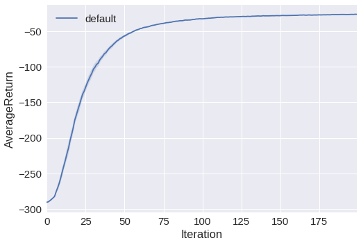
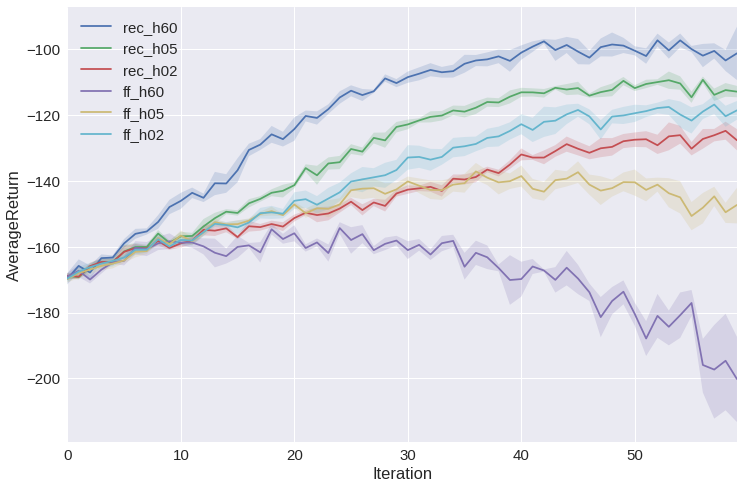
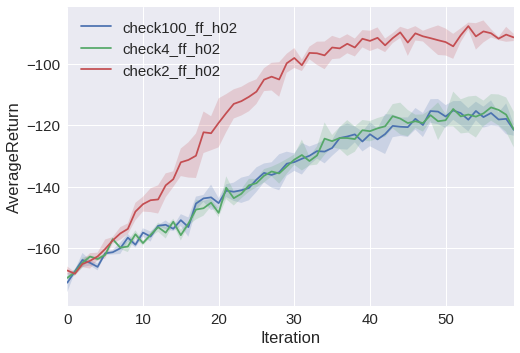
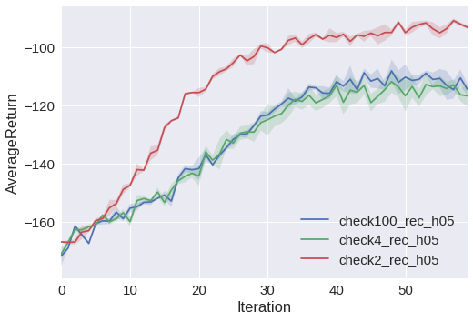
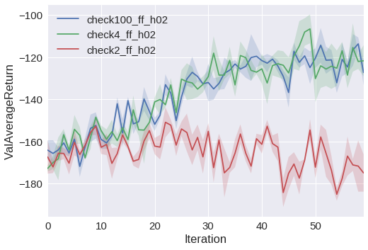
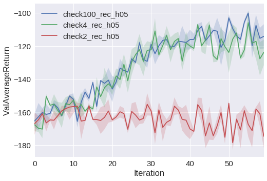

# CS294-112 HW 5c: Meta-Reinforcement Learning

## Overview
In this exercise meta-reinforcement learning as a technique of leveraging prior experiences is implemented.
The intuition behind it is to "learn how to learn best" as humans are normally practicing when they are confronted with an unseen task:

They don't have to solve new tasks from scratch instead they previously figured out how to learn and built up a prior knowledge so that a few trails are sufficient for new tasks.

This exercise, in particular, focuses on:
- **Contextual policies**: A policy is learned once where another functional policy for a similar task could be obtained by just using a few trails.
In this case, Fine-Tuning might be a good guess, but in practice, it turns out that it isn't robust enough because it does not generalize well to similar tasks.
However, through a contextual policy, a context (i.e. task id) is provided so that the policy learns all tasks at once and conditions its execution on that context prior.
Hopefully, this policy does generalize more deliberately because it can't depend on one particular solution anymore but instead more on the common similarity of those tasks.
- **Recurrent policies**: A recurrent policy has the great advantage of having an internal/hidden state throughout the whole episode.
With that, the algorithm is essentially able to achieve results in unlimited similar tasks even in ones never seen before because it figures out through the interaction with the environment (e.g. the rewards received) which task is present and how to effectively solve it.
Previously it is learned to learn which task is present and how to solve it.

More resources towards the topic could be accessed here:
[Mishra et al. (2018)](https://arxiv.org/abs/1707.03141),
[Finn et al. (2017)](https://arxiv.org/abs/1703.03400),
[Wang et al. (2016)](https://arxiv.org/abs/1611.05763),
[Duan et al. (2016)](https://arxiv.org/abs/1611.02779).

## Usage
```
python <env_name: pm|pm-obs>
```
General parameters:
- `--exp_name`: Name of the experiment. Default: `exp`
- `--render`: Boolean desire to render. Default: `False`
- `--discount`: Discount factor of Actor-Critic. Default: `0.99`
- `--n_iter | -n`: Number of training iterations. Default: `100`
- `--batch_size | -pb`: Number of episodes per training iteration. Default: `10000`
- `--mini_batch_size | -mpb`: Length of batch recieved from buffer to train PPO-Agent. Default: `64`
- `--num_tasks | -nt`: Number of different tasks to be executed in one mini-batch. Default: `1`
- `--ep_len | -ep`: Maximal length of one episode (if no done signal recieved yet). Default: `20`
- `--learning_rate | -lr`: Learning rate of Actor-Critic. Default: `5e-4`
- `--num_value_iters | -nvu`: Number of iterations to update the critic. Default: `1`
- `--seed`: Random-Seed. Default: `1`
- `--n_experiments | -e`: Total number of parallel experiments. Default: `1`
- `--n_layers | -l`: Number of hidden layers in Actor and Critic. Default: `1`
- `--size | -s`: Dimension of hidden FF-layer. Default: `64`

Problem-specific parameters:
- `--gru_size | -rs`: Dimension of hidden GRU-layer. Default: `32`
- `--history | -ho`: Length of the episode's history passed to the FF/GRU-network. Default: `1`
- `--l2reg | -reg`: Boolean desire to use l2-regularization on the critic. Default: `False`
- `--recurrent | -rec`: Boolean desire to use the recurrent architecture instead of the feed-forward one. Default: `False`
- `--checkerboard_size`: Grid size fraction of the pm-checkerboard. Determines how much test/train tasks should be apart. Default: `0.`

## Results
### Observed PointMass environment
This environment is basically a *(20,20)* grid, where the agent starts at *(10,10)* with the goal to reach either *(0,0)*, *(20,0)*, *(0,20)* or *(20,20)* determined by the *taskID {1..4}*.

```
python train_policy.py pm-obs --exp_name default --history 1 -lr 5e-5 -n 200 --num_tasks 4
```


Okay, now we're sure that our algorithms accomplish the discrete task setting successfully.

### PointMass environment
Let's try a slightly different environment, where everything keeps the same but instead we don't have any concrete specified goals. Instead, every point on the *(20,20)* grid could be a valid goal.



What we are able to see in this comparison is basically that first, our recurrent neural network outperforms the feedforward one significantly although it also takes longer in training time.
Second, the feed-forward network performs in contrast to the recurrent model increasingly better with a lower history.

That's mainly due to the facts that the weights increase proportionally with the input dimension (history length), the input is shifting with ongoing episode instead of being fixed in its meaning and the network has to cover too much of unstructured data.
Nonetheless, with a history length of 1 or 2, it actually doesn't matter that much.

The recurrent model, in contrast, is not only designed for such kind of tasks moreover it also keeps the number of weights the same independently of the history length. With that, every new history information does increase the available information without increasing the complexity of the network.

### Training vs. testing goals in PM-env
Through dividing the PointMass environment into a checkerboard grid whereas the black tiles represent the environment on evaluation and the white ones on training we are now able to track how much the model generalizes by setting the test goals apart from the training ones.
In this case, a checkerboard of size *0.1* e.g. means a *10x10* grid.

|                   | feed-forward                            | recurrent                                |
| :---------------: |:---------------------------------------:| :---------------------------------------:|
| **training time** |  |  |
| **test time**     |   |   |

As presented in above's comparison it clearly stands out that a checkerboard of size *2x2* (value: *0.5*) does perform on training time better due to its significantly smaller solution space however on test time it performs quite worse.

Luckily, a checkerboard of size *4x4* seems to be enough for a good generalization!

Also, note that between the recurrent and the feed-forward net no differences are present with respect to their ability to generalize.

## Dependencies:
 * Python *3.6*
 * Numpy version *1.14.6*
 * TensorFlow version *1.13.1*
 * OpenAI Gym version *0.10.11*
 * seaborn version *0.7.1*

See the [HW5c PDF](http://rail.eecs.berkeley.edu/deeprlcourse/static/homeworks/hw5c.pdf) for further instructions.